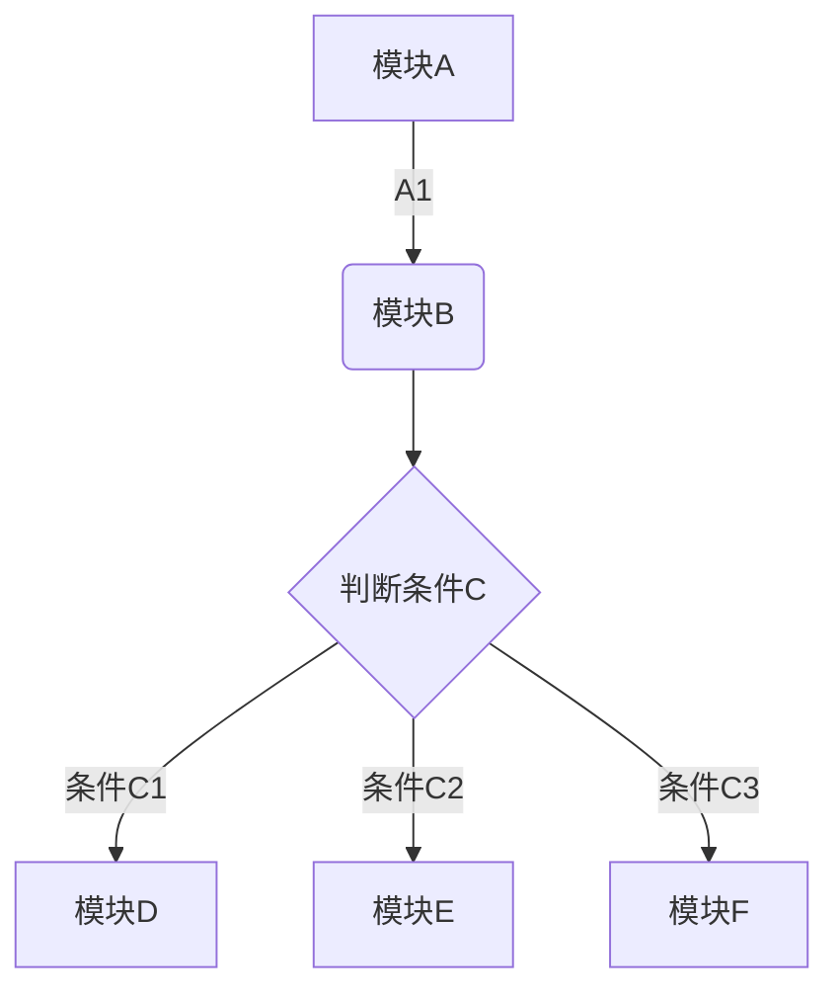
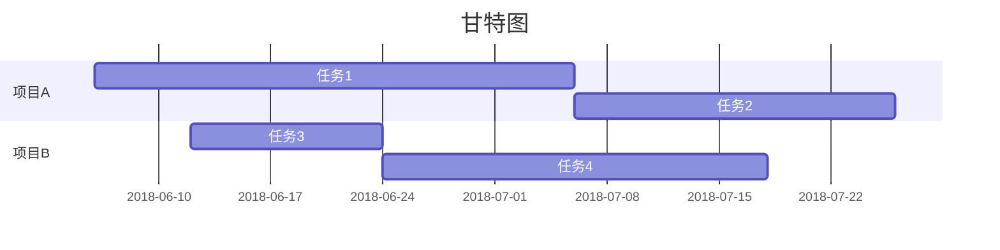
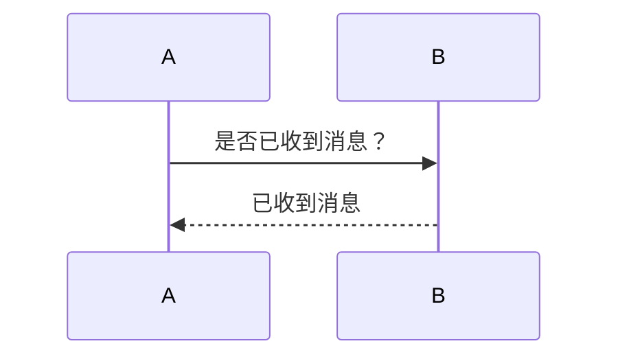

# 文章类型
|id|name| 
|:-|:-|
|0|草稿|
|1|普通|
|2|原创|
|3|转载|
|4|笔记|
|5|专栏|

# 文章中嵌入特殊元素
## 嵌入svg
```html
<div class="post-svg-container">
    <object type="image/svg+xml" data="xxx.svg"></object>
</div>
```

## 流程图


## 甘特图


## 时序图

